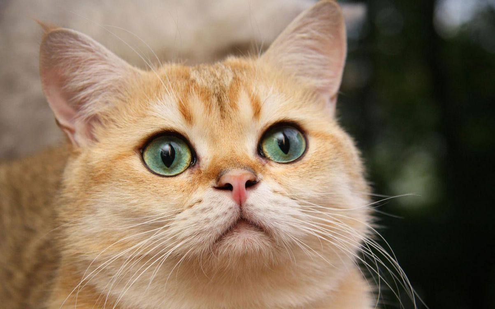

# Кот по имени "Томас"

Зря говорят, что **коты** не хотят стать программистами. Я очень *целеустремленный* кот, как видите, дошел до конца курса [GIT-53](https://netology.ru/profile/program/git-53/).

Далее меня ждёт курс по алгоритмам, хочу узнать много нового о:
* сортировках,
* пирамидах,
* графах,
* алгоритмах поиска.

***Слава котам!***